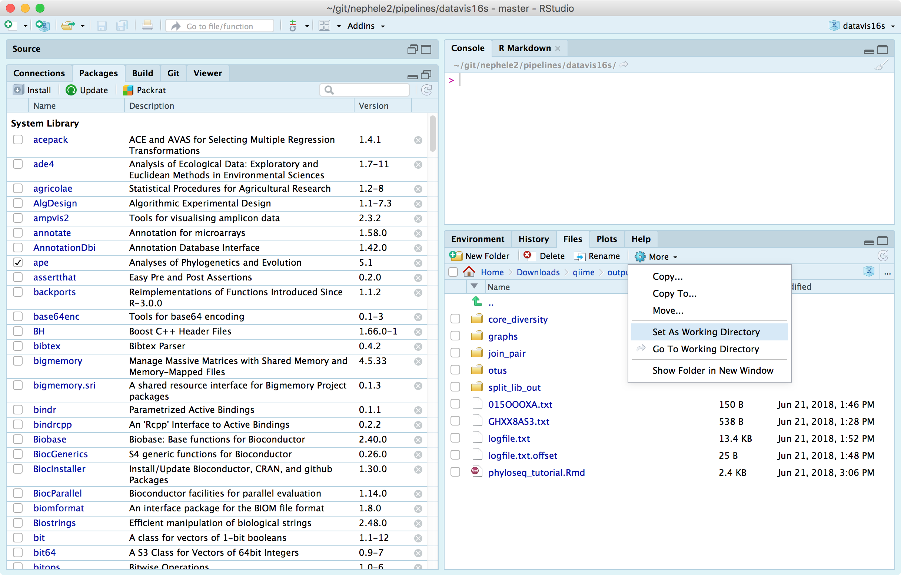

```{r setup, include=FALSE}
knitr::opts_chunk$set(tidy=TRUE, eval=TRUE)
```

These are some general instructions for how to import the outputs from Nephele into [phyloseq](https://joey711.github.io/phyloseq/){target="_blank" rel="noopener noreferrer"}.

### Software requirements
Please refer to the websites linked here for installation and usage instructions:

- [R](https://cran.r-project.org/){target="_blank" rel="noopener noreferrer"}
- [phyloseq](https://joey711.github.io/phyloseq/install.html){target="_blank" rel="noopener noreferrer"} - installing phyloseq will also install the other packages used in this tutorial.
- [RStudio](https://www.rstudio.com/products/rstudio/download/#download){target="_blank" rel="noopener noreferrer"} - not required, but helpful if you are new to R.

### Tutorial
@. Download and unzip the PipelineResults folder from your Nephele job. This folder contains all of the data and files used in processing your job.
@. In the files pane of RStudio navigate to your unzipped outputs folder and under the "More" dropdown, choose `Set As Working Directory`.
```{r screenshot, out.width="50%", echo=F}

```
@. In the Console, enter the following:
    ```{r}
    library(phyloseq)
    ```
@. To import the data as a phyloseq object, use phyloseq's `import_biom` command. 
- DADA2  
    ```{r}
    mydata <- import_biom(BIOMfilename="taxa_species.biom")
    mydata
    ```
- QIIME    
You may see a warning message when importing the biom file from QIIME.
    ```{r}
    mydata <- import_biom(BIOMfilename="otus/otu_table_mc2_w_tax_no_pynast_failures.biom")
    mydata
    ```
@. Import the sample metadata with `import_qiime_sample_data` and merge it with the phyloseq object. Subsititute the name of your mapping file for *map_file.txt* inside the quotes.
    ```{r}
    mapfile <- import_qiime_sample_data("map_file.txt")
    mydata <- merge_phyloseq(mydata, mapfile)
    mydata
    ```
@. (Optional) To add a tree to the phyloseq object, use the [ape package](https://cran.rstudio.com/web/packages/ape/index.html){target="_blank" rel="noopener noreferrer"} to read in the tree file, and then add it to `mydata` using `phy_tree`.
- QIIME
    ```{r}
    library(ape)
    tree <- read.tree('otus/rep_set.tre')
    print(tree)
    phy_tree(mydata) <- tree
    mydata
    ```
